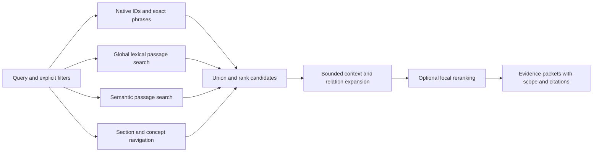

# Finding precise evidence in complex documents

Implementation status: the user approved this plan. The first isolated implementation,
source checks, parser comparison and remaining adoption gates are recorded in
[the implementation report](needle-retrieval-implementation.md). The original audit
below describes the pre-change baseline.
The [document-store continuation](document-store-implementation.md) records the
explicit input contract, migration and rebuild-parity work.
[Source navigation](source-navigation-implementation.md) and
[local model experiments](needle-model-experiments.md) record subsequent work.
[Real-corpus scale validation](needle-scale-implementation.md) records final Windows
and Linux query passes, answer/artifact parity, and the remaining update and freshness limits.

Planning baseline, 2026-09-05. The planning turn inspected the implementation, audited the selected
pilot generation, ran diagnostic queries, reviewed source PDF pages and researched
existing approaches. The observations below predate the implementation linked above.

## 1. Decision

Make the primary product a fast evidence finder with reliable document navigation.
Keep a precise address for a paragraph, provision, table cell or other source
region. Build coherent search passages over those addresses. Return the matching
evidence together with the scope and supporting material needed to interpret it.

**Source region, document section, retrieval passage and returned context are four
different things.** Our implementation currently couples them too tightly.

The original spec's section boundaries were intended to retain the conditions and
consequences of a provision. Its one-file/one-chunk implementation rule has become
an obstacle when applied to arbitrary parser headings. Preserve canonical section
boundaries, provenance, historical revisions, exact search and graph navigation.
Replace the assumption that every parser heading deserves a file and a vector.

Larger passages are an experiment to measure, not the definition of success. A
short, self-contained definition can be excellent evidence. A short fragment with
its subject, applicability or exception elsewhere is a poor standalone result.

## 2. What the current corpus actually contains

Audit: generation `01788581250937340100`, 33 documents, 11,057 source units plus
33 generated document roots, 11,091 retrieval chunks. Counts below use whitespace
words, **not model tokens**. The audit reads immutable snapshot artifacts.

| Observed condition | Evidence | Consequence |
| --- | --- | --- |
| Many tiny chunks | Median chunk body: 41 words; 6,334/11,091 (57.1%) below 50; 2,766 below 20 | Search spends capacity on fragments and repeated labels. Size alone does not identify which ones are bad. |
| Corpus dominated by one source | FHA handbook: 10,438 chunks, 94.1% of the index | Aggregate counts and retrieval tests can hide weakness in other documents and formats. |
| Lost FHA hierarchy | All 10,437 units have no section parent; all 10,436 detected headings lack a heading level | Scope such as TOTAL versus Manual underwriting disappears from child breadcrumbs. |
| Empty content units | FHA has 2,241 units containing only their heading region | Containers and table-of-contents entries become ordinary primary candidates. |
| Oversized generated text | FHA root's generated heading list is a 70,524-word chunk | A navigation structure is indexed as a huge body passage and embedded once. |
| Oversized real content too | Twelve chunk bodies exceed 2,000 words; a paper with no detected headings has one 5,891-word source unit | The current split policy does not provide a general size bound. |
| HTML boilerplate survives | Fannie units include login/password links, “Have questions?”, “Other Sites” and “Skip to main content” | Repeated website furniture consumes rank, vectors and storage. |
| Display hides useful evidence | Four diagnostic queries reproduce heading-only snippets and sentences truncated before their distinguishing clause | Even some usable source units look like empty or ambiguous results. |

Evidence: [audit JSON](../eval/results/chunk-audit-2026-09-05.json),
[query responses](../eval/results/chunk-search-examples-2026-09-05.json).
Reproduce the audit with `python eval/chunk-audit.py 01788581250937340100`.
The JSON includes the generation, chunk hash and source-artifact hashes.

### Implementation causes

- `packages/sect-convert/src/elements/pdf.ts`: short bold/larger-font blocks become
  headings, but hierarchy levels are not reconstructed. Running headers/footers
  are typed yet are not automatically excluded by the organizer.
- `packages/sect-convert/src/document.ts`, `organizeDocument`: every heading starts
  another addressable unit. Unknown hierarchy becomes flat. There is no semantic
  passage assembly step, and the function does not consume profile boundary rules.
- `packages/sect-convert/src/elements/office.ts`: Readability's selected article
  is used for its title; extraction still walks the original body. Existing chrome
  rules miss visible site furniture that is not marked with the expected tags.
- `packages/sect-convert/src/ingest-file.ts`: every unit becomes Markdown, every
  document root gets a generated list of all units, and both enter ordinary search.
- `crates/sect-index/src/chunks.rs`: starts with one chunk per file, counts words as
  “tokens”, and only splits on lowercase `(a)`-style provision labels. It can split
  scientific figure labels while leaving a long ordinary section unsplit. Flattened
  table rows are appended to the final chunk, potentially duplicating table content
  and obscuring its precise source spans.
- `crates/sect-query/src/lib.rs`, `best_line`: chooses a line by substring overlap,
  including headings, then truncates at 220 characters. It does not construct a
  source-aligned, self-contained answer passage.

The last Rust performance pass established faster execution and result parity.
It did not establish that these source units or rankings are useful. These defects
take priority over another round of micro-optimization.

## 3. The example the new design must solve

I rendered and inspected the stored FHA PDF at PDF pages 255 and 334 (printed pages
230 and 309). Both contain a subsection named “Stability of Self-Employment
Income”. Their enclosing sections distinguish TOTAL from Manual underwriting;
their operative text differs. The pages also contain a definition, minimum-length
conditions and documentation requirements under explicit nested labels.

Today, units `u001463` and `u001994` have almost identical displayed titles and
generic document-root breadcrumbs. Searching for the income-decline distinction
returns those and other similar provisions with snippets cut before the relevant
difference. The engine finds words but makes the caller reconstruct applicability.

The proposed result should identify the applicable section path, present the
complete matching paragraph, preserve its conditions, link the nearby definition
and source-specific documentation, and distinguish alternative scopes. A comparison
query should return the two contexts separately. A query explicitly scoped to TOTAL
should preserve that filter throughout expansion.

The source's change annotations must also remain attached. A notice that text was
deleted within a section must not be interpreted automatically as retirement of the
whole section. This is a parsing/navigation example, not an underwriting conclusion.

## 4. Four representations with different responsibilities

| Representation | Purpose | Identity and contents |
| --- | --- | --- |
| Source regions | Exact quotation and audit | Immutable raw revision + native locator + text span; paragraphs, list items, equations, table cells, captions, footnotes. Preserve originals and reversible normalization maps. |
| Document sections | Navigation, applicability and stable references | True section tree, native labels, section Work/revision IDs, document title, parent, content roles and scope. A container may have no own body. |
| Retrieval passages | Find evidence efficiently | Rebuildable groups of source spans with bounded model input, section membership and indexing metadata. Passage IDs are derived from source revision, spans and recipe. |
| Evidence packets | Let a caller understand a hit | Query-selected passage plus enclosing scope, required definitions/conditions/headers/notes, precise citations, alternatives and explicit truncation. |

Small regions remain independently addressable without requiring one embedding per
region. A section can produce multiple passages. A passage can include several
adjacent regions while preserving each region's locator. Rechunking does not create
a new source revision or invalidate source-grounded knowledge evidence.

Use the existing Rust-owned interchange schema and generated TypeScript contracts.
Extend it with content roles, section intervals, source spans, normalization maps,
structure provenance/confidence, passage recipes and typed context dependencies.
Expose capabilities honestly: exact native structure, inferred structure and a flat
fallback are different states. Parser confidence `1.0` is not proof of organization.

## 5. Repair document reconstruction first

### Choose adapters by evidence and format

Native XML/HTML/Office structures should be preferred when their structure and
source mapping survive conversion. For PDF, compare the existing Docling integration
against the current parser on the same difficult pages; add GROBID as a research-paper
candidate. Pick per format/profile using measured coverage, hierarchy, reading order,
tables, equations, latency and failure behavior. No parser is assumed to win globally.

For FHA-like manuals, combine PDF outlines when available, numbering grammar,
indentation, typography, TOC targets and running section context. Boldness is one
signal. Track the numbering stack across pages and validate parent/child spans.
Keep uncertainty when these signals disagree. A model may propose a bounded repair
at ingestion, but it cannot replace source text or declare itself verified.

Running heads can carry useful scope: preserve that information as navigation
metadata while avoiding repeated body indexing. Distinguish source-authored TOCs,
generated navigation, bibliography, change notices, body text and site furniture.
Keep excluded regions with an explicit reason so parser changes are auditable.

### Preserve coherent structures

- HTML/DOCX: headings, paragraphs, nested lists and their introductory clauses.
  Select the actual content container and retain mappings to the original DOM or
  Office part/paragraph. Do not claim a synthetic page-1 coordinate is native evidence.
- Research XML/PDF: section/subsection hierarchy, figure/equation labels, captions,
  bibliography and footnotes. Join soft line breaks and repair hyphenation only with
  a source mapping; retain uncertainty around damaged symbols and column order.
- Tables/spreadsheets: header paths, units, row keys, merged cells, notes and cell
  coordinates. A row becomes searchable with its headers. Do not guess that the first
  row is always a header. Separate distinct tables within a sheet.
- JSON/XML records: preserve record/object relationships; index coherent records
  or record projections rather than isolated scalar values or one enormous object.
- Slides: preserve deck/slide/shape context and notes when available. A token target
  must not arbitrarily join unrelated slides.

Every relevant source region must be accounted for by a section or by an explicit
classification/exclusion. Failures in coverage or source mapping block the affected
publication. Heuristic tiny-chunk rates and uncertain hierarchy trigger diagnostics;
they do not universally reject valid short definitions or legitimately flat documents.

## 6. Add a Rust passage compiler

Replace the one-file-per-vector assumption in `sect-index::chunks` with a deterministic
compiler over organized documents. Keep a legacy Markdown importer feeding the same
internal representation so eCFR and hand-authored corpora continue to work.

An initial **experimental** policy is a 300–600 model-token target, with an 800-token
input ceiling including context. Compare it against 256/512/1,024-token alternatives
and whole coherent provisions. Use the actual selected embedder's tokenizer; counts
and truncation must be reported. These values are tuning parameters, not universal
defaults justified by this audit.

Assembly rules:

1. Begin with meaningful content units: paragraphs, provision groups, list lead-ins
   plus their items, or table row groups with their header context.
2. Merge small adjacent content only when section scope, role and dependencies are
   compatible. Keep explicit boundaries where applicability or record identity changes.
3. Split long sections at paragraph/sentence boundaries into linked passage spans.
   The canonical provision remains intact. Mark continuations and preserve the
   information needed to retrieve all parts when a full provision is requested.
4. An oversize sentence/table row needs an explicit bounded fallback with preserved
   spans and continuation/header references. Never silently truncate model input.
5. Retain the heading path and a short, source-grounded applicability prefix. Keep
   body, native identifiers, headings, context and inferred aliases in separate
   lexical fields. Avoid repeating irrelevant ancestor prose or entire TOCs.
6. Use small boundary overlap only where it measurably improves recall. Record span
   overlap so result assembly can remove repeated text and avoid ranking inflation.
7. Store heading-only containers and TOCs in the navigation representation. Ordinary
   content search should resolve a heading match to appropriate body passages;
   explicit ID lookup and `map` can still return the container itself.

Retain exact surface forms, names, numbers, units, negation and qualifiers. An optional
generated contextual sentence is derived search metadata with its own recipe and
evidence; it never becomes a quotation. Model enrichment consumes coherent sections
with neighboring context, rather than whichever arbitrary passage happens to fit.

## 7. Retrieval: several access paths, one evidence contract

- **Exact route:** source-native IDs, citation variants, quoted phrases, rare terms,
  filenames and explicit numeric expressions. Preserve exact matching as an
  independent route for the needle that a broad semantic representation misses.
- **Lexical route:** Tantivy fielded BM25 over coherent passages, with original
  text and identifiers preserved. Keep exhaustive ripgrep-compatible behavior for
  `grep`; the ranked passage API does not claim exhaustive enumeration.
- **Semantic route:** keep Model2Vec as a cheap reference; compare better local
  contextual embeddings after representation repairs. Treat model choice and passage
  policy as separate experiments.
- **Navigation route:** section headings, aliases, definitions and graph postings
  add candidates. Document-level retrieval may improve priorities, but global exact
  and lexical candidates remain reachable. A wrong coarse routing decision must not
  permanently hide a needle.
- **Fusion/ranking:** use the current candidate union/RRF as the reference. Add
  scope match, evidence coverage and duplicate-span handling. Remove reliance on
  document popularity unless an ablation demonstrates benefit. Evaluate a local
  reranker over a bounded shortlist; no required network or generative query call.

Keep current top-100 lexical/top-100 semantic and bounded relation traversal as the
starting budget. Change budgets only from recall/latency curves. Do not arbitrarily
cap a document at one result when multiple distinct sections answer the query.
Collapse redundant overlapping evidence, while keeping versions and applicability
variants distinguishable. Inferred intent is a soft preference; only explicit user
filters or source-validated constraints may exclude candidates.

### Return usable evidence

Replace the 220-character best-line response with a bounded evidence packet. The
default shows complete matching sentences/provisions, a meaningful section path,
source revision and exact source locations. Return relevant table rows with headers
and units. Link or include the definition, lead-in, exception and footnote required
by the selected evidence. Distinguish primary evidence from supporting context.

The packet budget is configurable; initially test 1,500–3,000 total tokens across
results rather than padding every result to a fixed length. If required material
does not fit, return an explicit incomplete-context marker and exact continuation
addresses. Separate byte offsets, normalized-text offsets, Markdown lines and native
PDF/DOM/cell locators. Contextual index prefixes are not source lines.

Keep the seven verbs. Extend `search` and `read` with structured evidence/context
fields; `read` can expand a passage into its canonical section; `map` retains true
hierarchy; `refs`/`define` expose typed scoped relationships. Version the JSON response
contract and retain a legacy formatting mode during migration.

## 8. Ontology and graph: connect evidence that retrieval needs

Build the structural graph first: section containment, ordered region membership,
table headers, captions, footnotes, explicit citations and revisions. This supplies
the navigation the FHA example is currently missing.

Layer scoped concepts and evidence-backed semantic relations onto it: definitions,
aliases, applicability, exceptions, methods, populations, datasets and measurements.
Profiles define permitted types and boundary/context rules. Each edge includes its
source spans, revision, direction, qualifiers, provenance and verification state.
Anchor edges to source entities/spans, not ephemeral passage IDs.

Repeated labels such as “Definition” or identical text in TOTAL/Manual contexts do
not establish identity. Preserve alternatives and contradictions. A citation does
not prove support. An exception relationship must identify the rule and scope it
qualifies. Adjacency alone is insufficient to invent such a relationship.

The harness should identify unresolved references and terms after deterministic
organization, present bounded candidate targets to an optional extraction model,
validate source alignment, independently check semantic claims, and publish only
accepted edges. A missing relation must not make otherwise faithful text invisible.
Measure retrieval improvement and required-context coverage, not graph-node count.

## 9. Storage choices that also help speed

For new document ingestion, make organized document artifacts the canonical compiled
input. Store source text once per document/revision, with offsets and compact lookup
tables for sections and regions. Passage indexes reference spans; they do not require
a separate filesystem file for every paragraph. Markdown remains an inspectable
export, and native Markdown corpora remain a supported input mode.

This requires an explicit input contract. In document mode, freshness tracks raw
documents plus authored corrections, identity/profile artifacts and recipe bindings;
generated Markdown exports are not silently treated as editable source. In legacy
Markdown mode, tracked Markdown inputs remain authoritative and must still be checked.
An export edit cannot quietly modify a published source revision.

Publish immutable generations atomically and retain pinned readers. Cache by source
revision + extraction/organization/passage/model recipe. A passage-policy change
rebuilds derived indexes without rewriting source identities or raw evidence. Prefer
compact integer IDs, mapped text/vector artifacts and lazy source reads. Benchmark
the storage format before committing to an additional database or framework.

The current 100k synthetic default is 831 ms warm / 2,620 ms process-cold hybrid,
with 1,662 MiB peak MCP working set. The optional notification diagnostic is much
faster but does not qualify its freshness guarantees. Reducing derived-file fanout
may help the new document mode; 100k independently authored files still require
separate freshness/change-tracking work. Report both workloads honestly.

## 10. Ideas to borrow, and their limits

| Project/research | Applicable idea | Decision for Sect |
| --- | --- | --- |
| [Docling chunkers](https://docling-project.github.io/docling/concepts/chunking/) | Structure-based segmentation, tokenizer-aware splitting/peer merging, contextual serialization and table-header handling | Evaluate existing parser integration first; use its HybridChunker as an external comparison. A structurally weak parser output still needs diagnosis. |
| [GROBID](https://grobid.readthedocs.io/en/latest/) | Scientific document structure in TEI and source coordinates | Add a research PDF comparison adapter; measure equations, captions, references and reading order before adoption. |
| [LlamaIndex auto merging](https://developers.llamaindex.ai/python/framework/integrations/retrievers/auto_merging_retriever/) | Retrieve children and reconstruct larger parent context | Borrow the pattern in Rust, with explicit source spans, scope and context budgets. |
| [Anthropic contextual retrieval](https://www.anthropic.com/engineering/contextual-retrieval) | Chunk-specific context in both lexical and embedding representations | Evaluate concise applicability prefixes after hierarchy repair; current navigation breadcrumbs alone do not provide missing scope. Published gains are not our benchmark. |
| [Dense X Retrieval](https://arxiv.org/abs/2312.06648) | Retrieval granularity matters; self-contained propositions can outperform larger passages on its tasks | Keep fine evidence addresses and consider derived proposition views later. Random short fragments are not self-contained propositions. |
| [Late Chunking](https://arxiv.org/abs/2409.04701) | Contextualize tokens before pooling passage vectors | Later embedding experiment requiring an appropriate contextual model. It cannot be enabled by changing a chunk-size flag on static Model2Vec. |
| [RAPTOR](https://arxiv.org/abs/2401.18059) | Retrieve at multiple levels, including hierarchical summaries | Consider navigation summaries for broad questions. Generated summaries must lead back to source evidence and cannot replace exact retrieval. |
| [GraphRAG local search](https://microsoft.github.io/graphrag/query/local_search/) | Combine graph access points with linked original text under a context budget | Borrow evidence-linked expansion, not the whole framework or a required query-time generation step. |
| [PageIndex](https://github.com/VectifyAI/PageIndex) | Explicit document trees and traceable section navigation | Borrow inspectable hierarchy. Keep global lexical/dense routes; an LLM tree walk is not required for Sect's fast offline query path. |
| [Nanonets Context Graph](https://nanonets.com/products/context-graph) | Make dependencies and constraints explicit | Retain conditions and scope with retrieved evidence. Sect continues to retrieve source material rather than execute underwriting decisions. Product claims are not comparative evidence. |

These are primary documentation/research sources inspected on 2026-09-05. They
motivate controlled experiments; none proves a universal chunk size or parser.

## 11. Implement in reviewable stages

| Stage | Concrete deliverable | Exit evidence |
| --- | --- | --- |
| 0. Freeze the failures | Audit and source-span labels independent of current unit boundaries; before/after inspector | Reproduce tiny/empty chunks, giant root, footer contamination, missing hierarchy, ambiguous variants and truncated evidence on fixed sources. |
| 1. Recover document structure | Roles, scoped section tree, source mappings and parser comparison; retain legacy import | Inspected FHA TOTAL/Manual hierarchy is represented; Fannie furniture is classified; difficult paper sections and table notes retain source coverage. |
| 2. Compile retrieval passages | Rust passage compiler, tokenizer-aware budgets, context prefixes, recipe-based IDs | All indexed content maps back to source spans; model limits enforced; no generated mega-TOC vector; deterministic rebuilds and legacy invariants pass. |
| 3. Return complete evidence | Scope-aware ranking, overlap handling and evidence packets through CLI/MCP | Fixed failure queries show actual body evidence with required qualifiers and distinct applicability; source references resolve. |
| 4. Compare representations | Controlled passage, embedding and reranker ablations | Better evidence recall/coverage at a fixed context budget, without unacceptable latency or domain regressions. |
| 5. Pack and qualify | Document-backed source store, incremental invalidation, migration and larger real corpus | Same source answers survive rebuild/version changes; real scale, memory and freshness targets pass on Windows/Linux. |

Implement stages 0–3 as the first vertical slice, then evaluate before a full corpus
reingest or broad ontology enrichment. Use FHA pages around 255/334 plus their parent
sections, Fannie self-employment, a nested JATS paper with tables/notes, the attention
paper and the paper currently lacking detected headings. Add small Office/record
fixtures to prevent a PDF-specific internal design.

Main code areas: the existing extraction adapters and `organizeDocument`;
`sect-core` region/schema types; `sect-index::chunks` and artifact build paths;
`sect-query` ranking/read/context assembly; `sect-format`/`sect-verbs` contracts;
the review UI's source/section/passage inspector; and `eval/qualification.py`.
Do not duplicate organization rules in independent CLI and pipeline paths.

## 12. Validate the actual objective

Gold answers must reference immutable source revisions, locators and spans, with
required supporting spans labeled separately. Existing unit-only labels can become
too coarse when a long section is split; keep compatibility mappings and audit the
labels rather than treating every child passage as relevant. Split document families
before tuning to avoid leakage through near-duplicates or alternate revisions.

Measure four failure stages separately: source extraction, candidate recall, final
ranking and evidence-packet completeness. A reranker cannot repair missing source
text, and a perfect locator match does not prove a complete answer was returned.

Proposed gates, retaining the existing broader qualification requirements:

- **Source integrity:** every returned span resolves to the exact source revision;
  every relevant fixture region is accounted for; protected numbers, units and
  negation survive; no silent embedding truncation.
- **Known regressions:** all fixed FHA scope, table-header/footnote, continuation,
  future-revision and HTML-furniture cases pass. Heading-only navigation must not
  masquerade as a substantive answer to a body-content query.
- **Retrieval quality:** independently judged evidence Recall@5 at least 90% per
  domain; report nDCG, precision and required-context coverage at fixed token budgets.
  Retain the existing relation precision/coverage and supporting-recall gates.
- **Usefulness:** measure distinct relevant evidence per 1,000 returned tokens,
  redundant span rate, extra tool calls to obtain a complete answer, and no-answer
  behavior. Preserve the existing 30% agent tool-call reduction/no-accuracy-loss goal.
- **Scale:** warm p95 at most 500 ms, process-cold p95 at most 2 seconds, query RSS
  below 2 GiB on 100k real content passages on Windows and Linux. Also report raw
  documents, bytes/pages, source regions and revisions. Inflating heading/file counts
  does not demonstrate scale. Keep synthetic stress results separate.

Compare: current baseline; same parser with repaired passage assembly; improved
parser with old passage policy; improved parser plus passages; then context packing,
optional semantic models and reranking. This isolates where gains come from.
Use equivalent source evidence and context budgets when passage counts differ.
Report results by document family, format and task type, with sample sizes and
uncertainty. The four probes run in this planning turn are diagnostic examples,
not independent held-out accuracy evidence.

## 13. First visible outcome

The first implementation should let us open an original page, see its recovered
section tree, inspect exactly which spans form each search passage, issue the
failure queries, and compare the old result with a complete new evidence packet.
Boundary and scope corrections become versioned inputs to future ingestion.

That demonstration should precede another large indexing run or a claim that the
system generalizes. It directly tests whether Sect finds the right evidence and
makes it understandable quickly.
